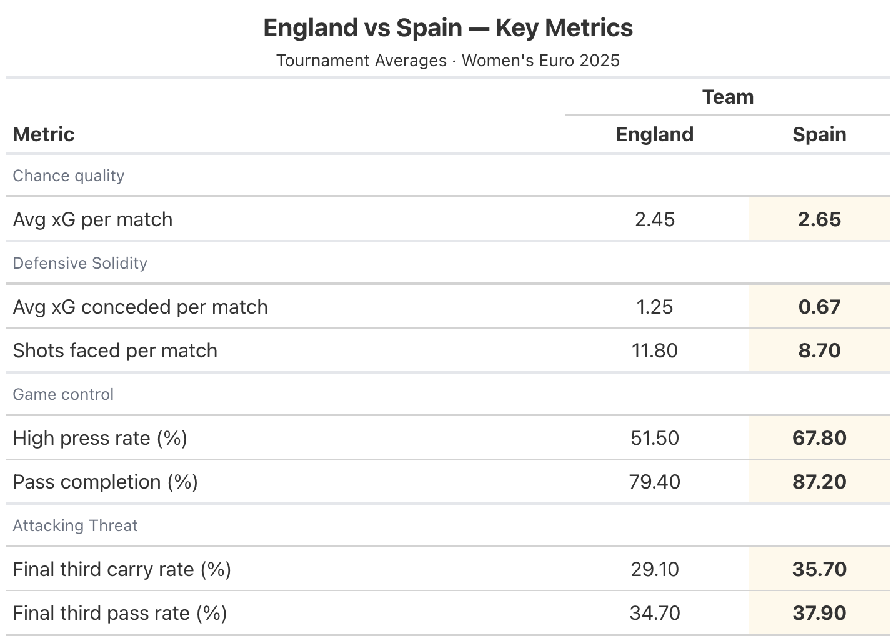

**Live dashboard:** <https://jbuergler.github.io/football-analytics/>

**Repository:** <https://github.com/jbuergler/football-analytics>

# Introduction and Research Question

The UEFA Women's European Championship (Euro) is one of the most important tournaments in women's football. The 2025 edition, hosted in in Switzerland from 2nd to 27th July 2025, came at a moment when the sport continues to grow in visibility, commercial value and public attention. The tournament has achieved record television audiences in the United Kingdom (cite: womens sport trust 2026). Sixteen nations competed across the group stage and knockout rounds, producing 106 goals across 31 matches and setting multiple tournament records (cite: uefa records article).

Research on women's football shows that this growth is part of a broader professionalisation, but that major gaps between the women's and men's game remain in areas such as commercial investment, media coverage, and resources (cite: tjonndal 2024 journal). This makes the tournament interesting not just because of who won, but about whether performance data supports the results. This is something that matters to fans, analysts, journalists, coaches, and anyone interested in how women's football is judged and valued.

The tournament ended with the final match at St. Jakob on the 27th of July 2025, where England faced Spain. England entered the tournament as the defending title holders, whereas Spain were the reigning World Cup holders. Spain's Aitana Bonmatí was named Player of the Tournament, while Esther González finished as the tournament's top scorer with four goals (cite: uefa top scorer article, uefa team of tournament article). Following a 1-1 draw after extra time, England won 3-1 on penalties to retain their European title (cite bbc sport final article).

The result, however, raised an immediate analytical question: did the scoreline reflect the balance of the play throughout the tournament and in the final itself? This project uses StatsBomb open event data to directly compare England and Spain's performances across the tournament and in the final itself, through metrics including expected goals (xG), pressing intensity, and ball progression. The central research question is:

**Did England deserve to win the Women's Euro 2025?**

This question matters because women's football is undergoing clear professionalisation, yet there are still major gaps with the men's game regarding visibility, financial conditions, and commercial value (cite: tjondall). Recent research also shows that professional women's football has evolved technically and tactically, with event data revealing longer possession sequences, fewer long-distance shots, and more difficult, valuable passes (cite bransen and davis). This makes event data a useful basis for assessing whether the result reflected the balance of play. For that reason, this project evaluates whether England's title win in 2025 was deserved on performance as well as on the scoreboard.

# Data Collection and Preparation

## Source and Access

For this project, event data for the UEFA Women's EURO 2025 was sourced via the `StatsBombR` package in R (cite: statsbomb open data). Recently, StatsBomb was incorporated into Hudl's industry-leading ecosystem of integrated video and analytic solutions (source hudl + statsbomb 2024). They are an established provider of football event data, recording over 3,400 events per match across more than 190 competitions and thus providing a wide range of data free of charge (hudl statsbomb source)

## Dataset Structure and Granularity

The raw data is structured at the event level, meaning that each row represents a single action during a match. This includes actions such as passes, carries, shots, pressures, and ball receipts. Each event has information on the player, team, match, time, pitch location (x, y coordinates), and action-specific attributes such as shot outcome and xG value for shots.

The full dataset covers 31 matches across the group stage and knockout rounds, including 875 shots after cleaning. Key variables used in this analysis include:

-   **location_x, location_y:** pitch coordinates of the action

-   **shot.statsbomb.xg:** expected goals value for each shot

-   **shot.outcome.name:** outcome of the shot (goal, saved, off target, etc.)

-   **type.name:** event type (shot, pass, carry, pressure, etc.)

-   **team.name:** the team performing the action

-   **player.name:** the player performing the action

-   **minute, period:** time context of the action

## Cleaning and Preparation

Several cleaning steps were applied to prepare the data for the analysis:

**Period filter:** StatsBomb records penalty shootouts as period 5. As penalty shootouts are based on individual shots rather than open play performance, all period 5 events were excluded from the analysis. This affected a total of three matches: the Sweden vs England semi-final, the France vs Germany quarter final, and the England vs Spain final.

**Own goals:** Own goals were excluded from the shot and xG analysis as they do not reflect the performance of the attacking team. This means goals from the analytical shot count (875 shots) differs slightly from the total goals shown in the dashboard (103 vs 106).

**Team name standardisation:** Team names were cleaned and standardised to ensure consistency across all tables and visualisations. Prefixes and Suffixes like "Women's" or "WNT" (for Finland) were removed.

**Pre-aggregation:** Summary tables for the different metrics analysed in this project were computed in advance and saved as `.rds` files. They are loaded directly by the Shiny dashboard. This approach improves loading speed and separates the data preparation from the app itself.

## Coverage and Caveats

As shown in @tbl-data-summary, the dataset covers all 31 matches of the UEFA Women's Euro 2025 tournament from the group stage through to the final. As coverage is subject to StatsBomb's data collection methodology, any recording errors cannot be ruled out.

This project analysed on-ball actions only. Off-ball movements and physical metrics such as distance covered are not included. This means that some aspects of performance, especially defensive organisation away from the ball, were not covered in this analysis. StatsBomb's freeze frame data, which records the location of all players involved in the event, including goalkeeper and defender positions at the moment of each shot (hudl statsbomb 2021 freeze frames) was not used in this analysis. However, it informed the pre-computed xG values available in the dataset, which makes them more contextually accurate. This directly represents a potential aspect, that future work could incorporate in the analysis. Across the full dataset, a total of 105,525 individual events were recorded.

StatsBomb records concrete pressing events when a player applies pressure to an opponent in possession, instead of computing pressure through combining multiple defensive actions (cite: dorrington pressure data in football 2025). This is an advantage, as it allows pressing intensity to be evaluated directly from recorded events.

```{r}
#| label: tbl-data-summary
#| tbl-cap: "Dataset Summary - UEFA Women's Euro 2025"

library(dplyr)
library(knitr)

data_summary <- data.frame(
  Item = c(
    "Source",
    "Access method",
    "Competition",
    "Matches",
    "Shots",
    "Granularity",
    "Period 5 excluded",
    "Own goals excluded"
  ),
  Detail = c(
    "StatsBomb open event data",
    "StatsBomb R package",
    "UEFA Women's Euro 2025 (ID: 53, Season: 315)",
    "31",
    "875",
    "Event level (one row per action), a total of 105,525 events",
    "Yes (penalty shootouts)",
    "Yes (from xG analysis)"
  )
)

knitr::kable(data_summary, col.names = c("Item", "Detail"))
```

# Methodology

## From Raw Data to Dashboard

This project follows a structured pipeline of five scripts, moving from raw data collection through to the interactive dashboard. Raw event data was pulled from StatsBomb in script `01_data.R`, explored in `02_explore.R`, cleaned in `03_clean.R`, aggregated into summary tables in `04_analyse.R`, and visualised in `05_visualise.R`. As a first step, only the planned static visuals were created, before moving them as interactive elements in `app/app.R`. After the app successfully ran locally on R, it was then deployed as the dashboard itself via Shinylive to GitHub. This ensures the analysis is reproducible and the dashboard only uses smaller, cleaned data tables, that are easier to load through Shiny.

## Metrics

All metrics were computed from the cleaned event data and aggregated into summary tables. The following metrics were used across the dashboard:

**Expected goals difference (xG diff):** For each match, xG difference was calculated as a team's total xG minus their opponent's total xG. Averaging this across all matches gives a tournament-wide measure to see whether a team consistently created better chances than they conceded. This is the primary metric for the Tournament Overview tab of the Dashboard.

**High press rate:** The high press rate was defined as the proportion of all pressure events happening in the opponent's half of the pitch (`location_x > 60` on the StatsBomb coordinate system, where the pitch runs from 0 to 120). StatsBomb records a pressure event each time a player actively applies pressure to an opponent in possession, which is a direct measure of pressing behaviour.

**Counter-press rate:** The counter-press rate was defined as the proportion of events that StatsBomb flagged as counter pressing. This refers to pressures applied within a short window of losing the ball. Missing values were recoded to `FALSE` so the full pressure count could be used to compute the rate in %.

Pass completion rate: The proportion of attempted passes that successfully reached a teammate from all open play passes. Unknown outcomes and injury clearances from `pass.outcome.name` were excluded. It is worth noting that in the StatsBomb data, `NA` values in `pass.outcome.name` refer to completed passes (statsbomb pdf source).

**Final third carry rate:** This refers to the proportion of all carries ending beyond `x = 80` on the StatsBomb coordinate system, which represents the final third of the pitch. This metric was chosen over the standard StatsBomb progressive carry definition (carries advancing the ball by at least 10 units). As it directly shows penetration into the attacking third instead of forward progress from any location, this was chosen as a more meaningful metric to analyse the attacking play.

**Final third pass rate:** The proportion of completed passes that ended beyond `x = 80` to measure how frequently each team moved the ball into the attacking third through passing.

**Shots faced per match:** The average number of shots conceded per match, used as a measure for defensive solidity alongside average xG conceded.

## Grouping and Filtering Decisions

All pressing metrics were split by stage type (group stage vs knockout rounds) to capture if there were any tactical shifts as the tournament progressed. The final match was isolated by selecting only the match ID of the final itself using `competition_stage == "Final"` and analysed separately across the tabs that focused on a detailed analysis of the events in the final between England and Spain. Actions of the best players were filtered to Bonmatí and Hemp specifically. They accumulated the most final third passes and carries for their teams.

## Dashboard Design

The dashboard was built using R Shiny with the `bslib` package for the layout and theme. A consistent colour palette was applied for the entire dashboard based on the official hex colours of Spain (`#F1BF00`) and England (`#CE1124`). All other teams were highlighted in grey to ensure England and Spain can be immediately identified across every chart.

The dashboard was structured across a total of six tabs that guides the reader through the story of the tournament and ultimately answering the research question. First, Tournament Facts and Context was provided about the competition itself, as well as manager, formation, and high-performing player information for England and Spain. After that, the Tournament Overview provided context of the team's performance regarding their expected goals (scored and conceded). Moving on, the Journey Tab shows the development of the two finalists throughout the tournament across metrics like accumulated xG, match-by-match xG and pressing. Afterwards, the final was analysed in more detail across two tabs to analyse the shot and xG situation, as well as the Possession in separate windows. The final was split across two tabs deliberately, as otherwise the plots would be too visually cluttered and overwhelming. Finally, an analytical decision was made based on the analysed metrics to answer the research question. This ensures that the reader is guided from a broad to specific context. Each tab includes a navigation sidebar that can be collapsed if need be, to give some initial context of what each tab is trying to show. A preview of the Dashboard can be found in Appendix A.

The individual chart types were chosen based on the analytical question each visualisation attempted to address. A horizontal bar chart (Tab 1) ranks all 16 teams by xG dominance, making the ranking immediately readable. A scatter plot (Tab 1) compares total xG against goals scored, showing which teams over- or underperformed in terms of goals. Cumulative line charts show how the xG and momentum changes across the tournament, while step charts show the xG accumulated shot by shot in the final. Pitch-based plots like shot maps (scatter plot) and player passmaps (arrow maps) use spatial data to show where on the pitch certain actions happened. Reference lines at +1 and -1 are added to the xG ranking chart to provide context to what refers to a meaningfully positive or negative xG difference per match.

Apart from two exceptions, all plotly charts include hover tooltips providing exact values for each elements of the plots. The xG Dominance ranking chart and player passmaps use static `renderPlot` instead of `plotly`. For the passmaps, this was due to a compatibility constraint between the `ggsoccer` package and the rendering mechanism of `plotly` in the Shinylive WebAssembly environment. For the xG ranking chart, the static approach was chosen, as interactivity does not add meaningful value to a ranked chart. The relative positions and reference lines at ±1 communicate the findings clearly without tooltips.

# Findings

## Tournament Picture

As shown in @fig-xg-ranking both England and Spain outperformed their expected goals across the tournament. Spain scored 18 goals from 15.91xG (+2.09) and England scored 16 goals from 14.68xG (+1.32). This suggests that both teams were clinical in front of goal, with Spain being slightly more clinical and also generating more chance quality.

```{r}
#| label: fig-xg-ranking
#| fig-cap: "xG Dominance Tournament Ranking — all 16 teams ranked by average xG difference per match. Spain led the tournament (+1.98), ahead of England (+1.20)."
#| fig-width: 6
#| fig-height: 3

readRDS("data/figures/fig_xg_ranking.rds")
```

Looking at the average xG difference in @fig-xg-scatter, Spain outperformed all other teams, having an average xG difference of +1.98 per match. This means that across all their six matches, they created significantly better chances than they conceded. England came third, having an average xG difference of +1.20 per match, just behind Sweden. This figure shows that both teams who reached the final performed above the +1 reference line, creating more quality chances in attack than conceding them. Wales had the lowest average xG difference per match (-2.65), which is reflected in their early group stage exit. However, this number is slightly inflated, due to their 1-6 loss against England on Matchday 3.

```{r}
#| label: fig-xg-scatter
#| fig-cap: "Goals scored vs total xG for all 16 teams. Teams above the dashed line scored more than expected and teams below the dashed line scored less than expected. Both England and Spain outperformed their xG, with Spain generating greater overall chance quality."
#| fig-width: 6
#| fig-height: 4

readRDS("data/figures/fig_xg_scatter.rds")
```

## The Journey to the Final

To compare England's and Spain's routes to the final and how they performed one by one until playing each other in Basel, several metrics were analysed.

@fig-cumulative-xg shows how both teams' cumulative xG increased over the whole tournament. The data shows that Spain had a consistent increase in xG, whereas England had a big increase on Matchday 3, due to their 6-1 win against Wales. Over the rest of the tournament both teams' values were at \~ 13.80 after the semi-finals, before Spain taking the lead after the final on July 27th. The overall difference, is at +1.23 for Spain. Overall, the figure shows that Spain had a more consistent attacking output throughout the tournament compared to England.

```{r}
#| label: fig-cumulative-xg
#| fig-cap: "Cumulative xG across the tournament for England and Spain. Spain built xG at a consistently higher rate, pulling clear from Match 4 onwards. Grey lines show all other teams."
#| fig-width: 6
#| fig-height: 3

readRDS("data/figures/fig_cumulative_xg.rds")
```

@fig-pressing shows the pressing intensity across high pressing and counter pressing. Evaluating both these metrics, Spain is ahead of England in the group stages and knockouts. They achieved their highest rates in the group stages with 76.6% (high-press rate) and 32.3% (counter-press rate). This reflects Spain's tactical approach of high-intensity, ball-oriented pressing. The data, however, shows that Spain in particular, reduced their pressing intensity in the knockouts, compared to the group stages. This is not surprising, considering the margins to win in the knockouts are usually higher, and a pressing done wrong could lead to a fatal counterattack. Surprisingly, England's counterpressing only marginally reduced in the later stages of the tournament (-2.50%). This shows that there was a smaller tactical change compared to Spain.

```{r}
#| label: fig-pressing
#| fig-cap: "Pressing intensity by stage — high press rate and counter-press rate for England and Spain across group stage and knockout rounds. Spain pressed higher at every stage."
#| fig-width: 6
#| fig-height: 3

readRDS("data/figures/fig_press_shift.rds")
```

## The Final

Looking at the attacking output in the final, Spain clearly dominated England on both analysed metrics. @fig-shot-map shows Spain had 23 shots compared to England's 8, demonstrating their will to create attacking threat. The location of Spain's attempts was also more centrally located around the penalty area, compared to England's more dispersed shot ranges. Both goals in the match were headers. Spain's Caldentey headed in from close range in the 24th minute (0.396 xG), while England's Russo equalised with a header in the 56th minute (0.213 xG).

```{r}
#| label: fig-shot-map
#| fig-cap: "Shot map for the Women's Euro 2025 Final. England attack from the left, Spain attack from the right. Circle size represents xG value. White ring indicates a goal. Spain registered 23 shots to England's 8."
#| fig-width: 6
#| fig-height: 3

readRDS("data/figures/fig_shot_map.rds")
```

As further shown in @fig-xg-timeline, Spain was dominating the attack from the opening minutes of the match, accumulating a total of 2.14 xG across their 23 shots by the end of extra time. England only reached a total xG of 0.88 from their 8 shots, but having a higher xG per shot (0.11 xG vs 0.09 xG). England recorded their last shot in the 68th minute, meaning that they created no further chances during the final 52 minutes of the match, including extra time. However, despite this xG gap, the match ended 1-1 after 120 minutes, with England winning 3-1 on penalties.

```{r}
#| label: fig-xg-timeline
#| fig-cap: "Cumulative xG Timeline for the Women's Euro 2025 Final. Spain dominated throughout, finishing with 2.14 xG. England's last shot was in the 68th minute. Green rings indicate goals."
#| fig-width: 6
#| fig-height: 3

readRDS("data/figures/fig_xg_timeline.rds")
```

When looking at the possession in the final, a few things stand out. First, Spain dominated the pass distribution into the attacking third of the pitch (29.2%) compared to England's 15.2% as shown in @fig-pass-thirds. England, however, made more passes within the defensive area of the pitch (37% vs 22.5%). This data illustrates Spain did not only had more shots, but also attempted to create more attacking threat as a team, showcasing their drive to win the match. Whereas, England's defensive dominance reflects their more conservative and compact approach in the final.

```{r}
#| label: fig-pass-thirds
#| fig-cap: "Completed pass distribution by pitch third in the final. Spain directed more passes into the attacking third, while England were more concentrated in the defensive third."
#| fig-width: 6
#| fig-height: 3

readRDS("data/figures/fig_final_pass_thirds.rds")
```

When looking at the most creative players for each team in the Final, there are also clear differences between Bonmatí's (Spain) and Hemps' (England) final-third actions. Despite both players playing the full 120 minutes, Bonmatí generated significantly more individual attacking threat. As shown in @fig-passmap, Bonmatí operated across the full width of the attacking third, completing final-third passes and carries from both central and wide positions. Hemp's actions were more concentrated on the left channel, which further reflects England's more conservative and positionally disciplined attacking approach.

```{r}
#| label: fig-passmap
#| fig-cap: "Final-third actions for Bonmatí (Spain) and Hemp (England) in the final. Arrows show completed passes and carries ending in the final third. Bonmatí operated across the full width of the attacking third while Hemp was concentrated through the left channel."
#| fig-width: 6
#| fig-height: 3

readRDS("data/figures/fig_player_passmap.rds")
```

## Analytical Outcome

As shown in @fig-verdict-table Spain led England on all seven performance metrics across the tournament. Spain averaged 2.65 xG per match compared to England's 2.45, while conceding considerably less (0.67 vs 1.25 xG per match). Moreover, their pass completion was notably higher (87.2% vs 79.4%). Pass completion only, however, does not directly mean better possession. But, Spain showed their attacking threat through other metrics. Particularly, for final third carries Spain had a 6.6 percentage point lead compared to England. Consequently, by attacking more, this also led to less shots faced per match (8.7 vs 11.8).

One finding that complicates this picture is England's pressing in the final itself. England applied 393 pressures compared to Spain's 253, even though Spain had a significantly higher high press rate across the tournament (67.8% vs 51.5%). This suggests that England's tactical approach in the final was more aggressive than the xG gap implies and their defensive resilience was a key factor. However, based on the data, Spain were the stronger side across all seven tournament-wide metrics.

```{r}
#| label: fig-verdict-table
#| fig-cap: "Key performance metrics — England vs Spain across the tournament. Spain led on all seven metrics. Highlighted cells indicate the leading team for each metric."
#| fig-width: 6
#| out-width: "80%"
#| fig-align: center


```

# Discussion, Limitations, and Conclusion

placeholder

# List of Tools Used {.unnumbered}

Anara Technologies (2026) *Anara* (Pro Version). Available at: <https://anara.com>

-   Assisted in understanding and summarising academic literature
-   Facilitated the organisation of research findings

Anthropic (2026) *Claude* (Version claude-sonnet-4-6). Available at: <https://claude.ai>

-   Assisted in debugging R code and Shiny app development
-   Support with structuring report sections
-   Proofreading and grammar check for cohesion and readability

Grammarly Inc. (2026) *Grammarly* (Free Version). Available at: <https://www.grammarly.com>

-   Support with spelling and grammar checks, including punctuation and preposition use

QuillBot (2026) *Paraphrasing Tool* (Free Version). Available at: <https://quillbot.com/paraphrasing-tool>

-   Assisting with paraphrasing sentences and sentence structures
-   Finding synonyms

Zotero (2026) *Zotero* (MacOS Version). Available at: <https://www.zotero.org/>

-   Assisting in the organisation of references and citations

# Appendices {.unnumbered}

## Appendix A: Dashboard Preview {.unnumbered}
